# NeuroDash — Database Design

Relational schema for the NeuroDash rehabilitation therapy monitoring platform, derived directly from the data model used in the working prototype (`neurodash.html`). Written for PostgreSQL, but nothing here relies on Postgres-only features beyond `UUID`, `JSONB`, `ENUM` types and generated columns — it maps cleanly onto MySQL 8+ or SQL Server with minor substitutions (noted inline).

## 1. Design approach

The prototype currently keeps everything as nested JavaScript objects in memory (a patient object carries its own `assessments[]`, `plans[]`, and each plan carries its own `dayLog[]`, and sessions carry their own `trials[]`). A real backend needs that flattened into proper tables so it can be queried, indexed, and updated by multiple concurrent users — a therapist logging a session shouldn't require rewriting a giant patient blob.

The design below normalizes to 3NF for anything that gets filtered, joined, or aggregated in the app's own analytics pages (patients, sessions, trials, issues, assessments), and uses `JSONB` only for genuinely variable-shaped data that the app treats as opaque (assessment item breakdowns, trial raw-data references, audit before/after snapshots). This mirrors how the prototype itself already treats those fields — the analytics/reports pages roll up sessions and trials with SQL-style filters and grouping, while assessment `items[]` are only ever displayed, never queried by sub-field.

Multi-tenancy: the prototype is single-organization ("Bio Rehabilitation Group"). If NeuroDash will ever serve more than one clinic, add an `org_id` column to every table below and a row-level security policy keyed on it; the schema is written so that's a mechanical addition later rather than a redesign now.

## 2. Entity-relationship diagram

```mermaid
erDiagram
    USERS ||--o{ PATIENTS : "treats (therapist_id)"
    USERS ||--o{ THERAPY_PLANS : "created_by"
    USERS ||--o{ ASSESSMENTS : "administered_by"
    USERS ||--o{ DEVICE_ISSUES : "opened_by / assigned_engineer"
    USERS ||--o{ DEVICE_REQUESTS : "requested_by / cleared_by"
    USERS ||--o{ AUDIT_LOG : "acted as"
    USERS ||--o{ NOTIFICATIONS : "recipient"
    USERS ||--o{ PATIENT_NOTES : "authored_by"

    PATIENTS ||--o{ ASSESSMENTS : "has"
    PATIENTS ||--o{ THERAPY_PLANS : "has"
    PATIENTS ||--o{ THERAPY_SESSIONS : "has"
    PATIENTS ||--o{ PATIENT_DOCUMENTS : "has"
    PATIENTS ||--o{ PATIENT_NOTES : "has"
    PATIENTS ||--o{ DEVICE_ASSIGNMENTS : "has"
    PATIENTS ||--o{ DEVICE_REQUESTS : "requested for"

    ASSESSMENT_TYPES ||--o{ ASSESSMENTS : "instance of"
    ASSESSMENT_TYPES ||--o{ ASSESSMENT_ITEM_DEFS : "defines"

    THERAPY_PLANS ||--o{ PLAN_DAY_LOG : "has"
    THERAPY_PLANS ||--o{ PLAN_REVISIONS : "has"
    THERAPY_PLANS }o--o{ DEVICE_TYPES : "plan_devices"
    THERAPY_PLANS ||--o{ THERAPY_SESSIONS : "produces (via day log)"

    PLAN_DAY_LOG ||--o{ THERAPY_SESSIONS : "contains"

    DEVICE_TYPES ||--o{ DEVICES : "instance of"
    DEVICE_TYPES ||--o{ DEVICE_MECHANISMS : "defines"
    DEVICE_TYPES ||--o{ DEVICE_GAMES : "defines"

    DEVICES ||--o{ THERAPY_SESSIONS : "used in"
    DEVICES ||--o{ DEVICE_ASSIGNMENTS : "assigned via"
    DEVICES ||--o{ DEVICE_ISSUES : "has"
    DEVICES ||--o{ DEVICE_MAINTENANCE : "has"
    DEVICES ||--o{ DEVICE_EVENTS : "has"
    DEVICES ||--o{ DEVICE_REQUESTS : "fulfills"

    THERAPY_SESSIONS ||--o{ SESSION_TRIALS : "contains"

    DEVICE_ISSUES ||--o{ ISSUE_TROUBLESHOOTING_LOG : "has"

    PATIENTS {
        uuid id PK
        text display_code UK "P-00124 style"
        text name
        date dob
        text gender
        text contact_phone
        text emergency_contact
        date registration_date
        uuid therapist_id FK
        text diagnosis
        text affected_side
        date stroke_date
        text mobility_status
        text_array therapy_goals
        text initial_observations
        text clinical_info
        text status
        timestamptz created_at
        timestamptz updated_at
    }

    USERS {
        uuid id PK
        text display_code UK "U-T1 style"
        text name
        text role "therapist|consultant|engineer|admin"
        text title
        text email UK
        text initials
        boolean is_active
        timestamptz created_at
    }

    ASSESSMENT_TYPES {
        text id PK "FMA, ARAT, BBS, WMFT"
        text name
        text version
        int max_score
        text domain
    }

    ASSESSMENTS {
        uuid id PK
        uuid patient_id FK
        text assessment_type_id FK
        uuid administered_by FK
        date assessment_date
        text label "Baseline, Day 7, Discharge"
        int score
        int max_score
        numeric percentage
        jsonb item_scores
        text notes
        timestamptz created_at
    }

    THERAPY_PLANS {
        uuid id PK
        uuid patient_id FK
        text name
        date start_date
        int duration_days
        int daily_target_minutes
        int target_sessions
        text_array goals
        text notes
        text status "Active|Paused|Completed|Discontinued"
        uuid created_by FK
        timestamptz created_at
    }

    PLAN_REVISIONS {
        uuid id PK
        uuid plan_id FK
        text field_changed
        text previous_value
        text new_value
        uuid modified_by FK
        text modified_by_role
        timestamptz modified_at
        text reason
    }

    PLAN_DAY_LOG {
        uuid id PK
        uuid plan_id FK
        int day_number
        date log_date
        text status "done|partial|missed|upcoming"
        int target_minutes
        int actual_minutes
    }

    THERAPY_SESSIONS {
        uuid id PK
        uuid patient_id FK
        uuid plan_id FK
        uuid plan_day_log_id FK
        uuid device_id FK
        int session_number
        date session_date
        timestamptz start_time
        timestamptz end_time
        numeric duration_minutes
        int total_targets
        int total_hits
        int total_misses
        int total_stars
        numeric accuracy_pct
    }

    SESSION_TRIALS {
        uuid id PK
        uuid session_id FK
        int trial_number_session
        int trial_number_day
        text trial_type "GAME|AROM|PROM|APROM"
        text game_id
        text mechanism
        int targets
        int hits
        int misses
        int stars
        timestamptz start_time
        timestamptz stop_time
        int cumulative_targets
        int cumulative_hits
        int cumulative_misses
        int cumulative_stars
        text raw_data_ref
    }

    DEVICE_TYPES {
        text id PK "PLUTO, MARS, ORION..."
        text name
        text category
        text color_series
    }

    DEVICE_MECHANISMS {
        uuid id PK
        text device_type_id FK
        text mechanism_name
    }

    DEVICE_GAMES {
        text id PK "HAT, PongGame..."
        text device_type_id FK
        text display_label
    }

    DEVICES {
        uuid id PK
        text display_code UK "PLUTO-003 style"
        text device_type_id FK
        text serial_number
        text firmware_version
        text status "Available|In Use|Issue Detected|Awaiting Engineer|Maintenance"
        text location
        date registered_on
        uuid current_patient_id FK
        timestamptz last_sync_at
    }

    DEVICE_ASSIGNMENTS {
        uuid id PK
        uuid device_id FK
        uuid patient_id FK
        date assigned_date
        date returned_date
        text status "In Use|Returned"
        uuid assigned_by FK
    }

    DEVICE_REQUESTS {
        uuid id PK
        uuid patient_id FK
        uuid therapist_id FK
        text device_type_id FK
        timestamptz requested_at
        text status "Pending Engineer Review|Cleared — Ready to Assign|Assigned"
        uuid engineer_id FK
        text notes
        timestamptz cleared_at
    }

    DEVICE_ISSUES {
        uuid id PK
        uuid device_id FK
        text description
        text severity "Low|Medium|High|Critical"
        text status "Open|Investigating|Resolved|Cleared"
        timestamptz opened_at
        uuid opened_by FK
        uuid engineer_id FK
        text diagnostics
        text parts_replaced
        text resolution
        timestamptz resolved_at
        timestamptz cleared_at
        uuid verified_by FK
    }

    ISSUE_TROUBLESHOOTING_LOG {
        uuid id PK
        uuid issue_id FK
        timestamptz logged_at
        uuid logged_by FK
        text note
    }

    DEVICE_MAINTENANCE {
        uuid id PK
        uuid device_id FK
        date maintenance_date
        text maintenance_type
        uuid engineer_id FK
        text notes
    }

    DEVICE_EVENTS {
        uuid id PK
        uuid device_id FK
        timestamptz event_date
        text event_type "registered|assigned|maintenance|issue|investigating|resolved|cleared"
        text description
    }

    PATIENT_DOCUMENTS {
        uuid id PK
        uuid patient_id FK
        text name
        text doc_type
        timestamptz upload_date
        uuid uploaded_by FK
        int size_kb
        text storage_ref
    }

    PATIENT_NOTES {
        uuid id PK
        uuid patient_id FK
        uuid author_id FK
        timestamptz note_date
        text text
    }

    NOTIFICATIONS {
        uuid id PK
        text target_role "therapist|consultant|engineer|admin|null=broadcast"
        uuid target_user_id FK "null = role broadcast"
        text notif_type
        text tone "good|info|warning|critical|neutral"
        text icon
        text title
        text description
        timestamptz created_at
        boolean is_read
        jsonb link
    }

    AUDIT_LOG {
        uuid id PK
        uuid actor_user_id FK
        text actor_role
        text action
        text entity_type
        uuid entity_id
        timestamptz occurred_at
        jsonb previous_value
        jsonb new_value
        text notes
    }
```



## 3. Table-by-table notes

A few decisions worth flagging before the DDL, because they depart slightly from a literal transcription of the prototype's in-memory objects:

- **`patients.display_code` vs `id`.** The prototype uses human-readable IDs (`P-00124`) as the actual primary key throughout. In a real system, keep those as a stable, unique *display* code (clinicians and device CSVs reference it) but use a `UUID` as the true primary key, so device CSV imports, merges, and re-numbering never risk collisions — the prototype already hit exactly this bug once (patient ID collision at `P-00124`) purely from a fragile sequential-formula approach; a surrogate key removes the whole class of bug.
- **Assessments: `item_scores` as JSONB, not a child table.** Each assessment type (FMA, ARAT, BBS, WMFT) defines a different fixed set of sub-items with different max scores. Rather than an EAV-style `assessment_item_scores` table, `ASSESSMENT_ITEM_DEFS` records the *shape* per type (for form rendering and validation) and each assessment instance stores its actual `item_scores` as JSONB `[{label, max, score}]` — the app only ever displays these, never filters by a specific sub-item score, so a child table would add joins with no query benefit.
- **Sessions and trials are real tables, not JSON.** Unlike assessment items, sessions and trials are exactly what the Analytics, Reports, and device-utilization pages aggregate over (accuracy trends, minutes used per device, stars per day) — these need to be indexed and summed in SQL, so they're fully normalized rows, one per trial.
- **`plan_devices` as a join table**, not a text array, even though the prototype stores `plan.devices` as a simple array of device-type IDs — a plan can involve more than one device type (e.g., Pluto + Mars), and this needs to support reporting like "how many active plans use device X" without unpacking arrays.
- **Device issue troubleshooting log is a child table**, not a JSON array, because engineers append to it incrementally over the life of an issue (exactly matching the "Report Issue" → "Investigate" → "Resolve" → "Clear" workflow now built into the app) and each entry has its own author and timestamp worth indexing on for the audit trail.
- **Notifications target either a role or a specific user.** The prototype seeds notifications per-role broadcast (`role:'engineer', userId:null`) as well as per-user; the schema keeps both columns nullable with the convention that a null `target_user_id` means "every user with this role sees it," matching existing behavior exactly.
- **Audit log stores before/after as JSONB**, since the audited entities (patients, plans, devices, issues) have heterogeneous shapes — this table is intentionally schema-loose, matching its real purpose as an immutable, generic activity ledger rather than a queryable business table.

## 4. Full DDL (PostgreSQL)

```sql
-- ============================================================
-- EXTENSIONS
-- ============================================================
CREATE EXTENSION IF NOT EXISTS "pgcrypto"; -- for gen_random_uuid()

-- ============================================================
-- USERS & AUTH
-- ============================================================
CREATE TYPE user_role AS ENUM ('therapist', 'consultant', 'engineer', 'admin');

CREATE TABLE users (
    id              UUID PRIMARY KEY DEFAULT gen_random_uuid(),
    display_code    TEXT UNIQUE NOT NULL,          -- e.g. 'U-T1'
    name            TEXT NOT NULL,
    role            user_role NOT NULL,
    title           TEXT,
    email           TEXT UNIQUE NOT NULL,
    initials        TEXT,
    is_active       BOOLEAN NOT NULL DEFAULT TRUE,
    password_hash   TEXT,                          -- nullable here; real auth likely lives in an IdP
    created_at      TIMESTAMPTZ NOT NULL DEFAULT now()
);
CREATE INDEX idx_users_role ON users(role);

-- ============================================================
-- REFERENCE DATA — assessment & device catalogs
-- ============================================================
CREATE TABLE assessment_types (
    id          TEXT PRIMARY KEY,      -- 'FMA','ARAT','BBS','WMFT'
    name        TEXT NOT NULL,
    version     TEXT,
    max_score   INT NOT NULL,
    domain      TEXT
);

CREATE TABLE assessment_item_defs (
    id                  UUID PRIMARY KEY DEFAULT gen_random_uuid(),
    assessment_type_id  TEXT NOT NULL REFERENCES assessment_types(id) ON DELETE CASCADE,
    label               TEXT NOT NULL,
    max_score           INT NOT NULL,
    sort_order          INT NOT NULL DEFAULT 0
);

CREATE TABLE device_types (
    id              TEXT PRIMARY KEY,      -- 'PLUTO','MARS',...
    name            TEXT NOT NULL,
    category        TEXT NOT NULL,
    color_series    TEXT                   -- chart color-slot reference, e.g. 'series-1'
);

CREATE TABLE device_mechanisms (
    id              UUID PRIMARY KEY DEFAULT gen_random_uuid(),
    device_type_id  TEXT NOT NULL REFERENCES device_types(id) ON DELETE CASCADE,
    mechanism_name  TEXT NOT NULL
);

CREATE TABLE device_games (
    id              TEXT PRIMARY KEY,      -- 'HAT','PongGame',...
    device_type_id  TEXT NOT NULL REFERENCES device_types(id) ON DELETE CASCADE,
    display_label   TEXT NOT NULL
);

-- ============================================================
-- PATIENTS
-- ============================================================
CREATE TYPE patient_status AS ENUM ('New', 'Assessment Pending', 'Active', 'Paused', 'Completed', 'Discontinued');

CREATE TABLE patients (
    id                  UUID PRIMARY KEY DEFAULT gen_random_uuid(),
    display_code        TEXT UNIQUE NOT NULL,          -- 'P-00124'
    name                TEXT NOT NULL,
    dob                 DATE,                             -- age is derived at query time (EXTRACT(YEAR FROM AGE(dob))),
                                                            -- not stored: AGE() is not immutable, so it can't back a
                                                            -- generated column and would silently go stale if cached.
    gender              TEXT,
    contact_phone       TEXT,
    emergency_contact   TEXT,
    registration_date   DATE NOT NULL DEFAULT CURRENT_DATE,
    therapist_id        UUID NOT NULL REFERENCES users(id),
    diagnosis           TEXT,
    affected_side       TEXT,
    stroke_date         DATE,
    mobility_status     TEXT,
    therapy_goals       TEXT[],
    initial_observations TEXT,
    clinical_info       TEXT,
    status              patient_status NOT NULL DEFAULT 'New',
    created_at          TIMESTAMPTZ NOT NULL DEFAULT now(),
    updated_at          TIMESTAMPTZ NOT NULL DEFAULT now()
);
CREATE INDEX idx_patients_therapist ON patients(therapist_id);
CREATE INDEX idx_patients_status ON patients(status);
CREATE INDEX idx_patients_registration_date ON patients(registration_date);

CREATE TABLE patient_documents (
    id              UUID PRIMARY KEY DEFAULT gen_random_uuid(),
    patient_id      UUID NOT NULL REFERENCES patients(id) ON DELETE CASCADE,
    name            TEXT NOT NULL,
    doc_type        TEXT,
    upload_date     TIMESTAMPTZ NOT NULL DEFAULT now(),
    uploaded_by     UUID REFERENCES users(id),
    size_kb         INT,
    storage_ref     TEXT                                -- S3 key / blob path
);
CREATE INDEX idx_patient_documents_patient ON patient_documents(patient_id);

CREATE TABLE patient_notes (
    id              UUID PRIMARY KEY DEFAULT gen_random_uuid(),
    patient_id      UUID NOT NULL REFERENCES patients(id) ON DELETE CASCADE,
    author_id       UUID NOT NULL REFERENCES users(id),
    note_date       TIMESTAMPTZ NOT NULL DEFAULT now(),
    text            TEXT NOT NULL
);
CREATE INDEX idx_patient_notes_patient ON patient_notes(patient_id, note_date DESC);

-- ============================================================
-- ASSESSMENTS
-- ============================================================
CREATE TABLE assessments (
    id                  UUID PRIMARY KEY DEFAULT gen_random_uuid(),
    patient_id          UUID NOT NULL REFERENCES patients(id) ON DELETE CASCADE,
    assessment_type_id  TEXT NOT NULL REFERENCES assessment_types(id),
    administered_by     UUID REFERENCES users(id),
    assessment_date     DATE NOT NULL,
    label               TEXT,                           -- 'Baseline','Day 7','Discharge'
    score               INT NOT NULL,
    max_score           INT NOT NULL,
    percentage          NUMERIC(5,2) GENERATED ALWAYS AS (ROUND(score::NUMERIC / NULLIF(max_score,0) * 100, 2)) STORED,
    item_scores         JSONB,                           -- [{label, max, score}, ...]
    notes               TEXT,
    created_at          TIMESTAMPTZ NOT NULL DEFAULT now()
);
CREATE INDEX idx_assessments_patient ON assessments(patient_id, assessment_date);
CREATE INDEX idx_assessments_type ON assessments(assessment_type_id);

-- ============================================================
-- THERAPY PLANS
-- ============================================================
CREATE TYPE plan_status AS ENUM ('Active', 'Paused', 'Completed', 'Discontinued');

CREATE TABLE therapy_plans (
    id                      UUID PRIMARY KEY DEFAULT gen_random_uuid(),
    patient_id              UUID NOT NULL REFERENCES patients(id) ON DELETE CASCADE,
    name                    TEXT NOT NULL,
    start_date              DATE NOT NULL,
    duration_days           INT NOT NULL,
    daily_target_minutes    INT NOT NULL,
    target_sessions         INT,
    goals                   TEXT[],
    notes                   TEXT,
    status                  plan_status NOT NULL DEFAULT 'Active',
    created_by              UUID NOT NULL REFERENCES users(id),
    created_at              TIMESTAMPTZ NOT NULL DEFAULT now()
);
CREATE INDEX idx_plans_patient ON therapy_plans(patient_id);
CREATE INDEX idx_plans_status ON therapy_plans(status);

-- a plan may involve more than one device type
CREATE TABLE plan_devices (
    plan_id         UUID NOT NULL REFERENCES therapy_plans(id) ON DELETE CASCADE,
    device_type_id  TEXT NOT NULL REFERENCES device_types(id),
    PRIMARY KEY (plan_id, device_type_id)
);

CREATE TABLE plan_revisions (
    id                  UUID PRIMARY KEY DEFAULT gen_random_uuid(),
    plan_id             UUID NOT NULL REFERENCES therapy_plans(id) ON DELETE CASCADE,
    field_changed       TEXT NOT NULL,
    previous_value      TEXT,
    new_value           TEXT,
    modified_by         UUID NOT NULL REFERENCES users(id),
    modified_by_role    TEXT NOT NULL,
    modified_at         TIMESTAMPTZ NOT NULL DEFAULT now(),
    reason              TEXT
);
CREATE INDEX idx_plan_revisions_plan ON plan_revisions(plan_id, modified_at);

CREATE TYPE day_log_status AS ENUM ('done', 'partial', 'missed', 'upcoming');

CREATE TABLE plan_day_log (
    id              UUID PRIMARY KEY DEFAULT gen_random_uuid(),
    plan_id         UUID NOT NULL REFERENCES therapy_plans(id) ON DELETE CASCADE,
    day_number      INT NOT NULL,
    log_date        DATE NOT NULL,
    status          day_log_status NOT NULL DEFAULT 'upcoming',
    target_minutes  INT NOT NULL,
    actual_minutes  INT NOT NULL DEFAULT 0,
    UNIQUE (plan_id, day_number)
);
CREATE INDEX idx_day_log_plan_date ON plan_day_log(plan_id, log_date);

-- ============================================================
-- DEVICES
-- ============================================================
CREATE TYPE device_status AS ENUM ('Available', 'In Use', 'Issue Detected', 'Awaiting Engineer', 'Maintenance');

CREATE TABLE devices (
    id                  UUID PRIMARY KEY DEFAULT gen_random_uuid(),
    display_code        TEXT UNIQUE NOT NULL,           -- 'PLUTO-003'
    device_type_id      TEXT NOT NULL REFERENCES device_types(id),
    serial_number       TEXT NOT NULL,
    firmware_version    TEXT,
    status              device_status NOT NULL DEFAULT 'Available',
    location            TEXT,
    registered_on       DATE NOT NULL DEFAULT CURRENT_DATE,
    current_patient_id  UUID REFERENCES patients(id),
    last_sync_at        TIMESTAMPTZ,
    updated_at          TIMESTAMPTZ NOT NULL DEFAULT now()
);
CREATE INDEX idx_devices_type ON devices(device_type_id);
CREATE INDEX idx_devices_status ON devices(status);
CREATE INDEX idx_devices_current_patient ON devices(current_patient_id);

CREATE TABLE device_assignments (
    id              UUID PRIMARY KEY DEFAULT gen_random_uuid(),
    device_id       UUID NOT NULL REFERENCES devices(id) ON DELETE CASCADE,
    patient_id      UUID NOT NULL REFERENCES patients(id) ON DELETE CASCADE,
    assigned_date   DATE NOT NULL,
    returned_date   DATE,
    status          TEXT NOT NULL DEFAULT 'In Use',      -- 'In Use' | 'Returned'
    assigned_by     UUID REFERENCES users(id)
);
CREATE INDEX idx_assignments_device ON device_assignments(device_id);
CREATE INDEX idx_assignments_patient ON device_assignments(patient_id);

CREATE TYPE request_status AS ENUM ('Pending Engineer Review', 'Cleared — Ready to Assign', 'Assigned');

CREATE TABLE device_requests (
    id              UUID PRIMARY KEY DEFAULT gen_random_uuid(),
    patient_id      UUID NOT NULL REFERENCES patients(id) ON DELETE CASCADE,
    therapist_id    UUID NOT NULL REFERENCES users(id),
    device_type_id  TEXT NOT NULL REFERENCES device_types(id),
    requested_at    TIMESTAMPTZ NOT NULL DEFAULT now(),
    status          request_status NOT NULL DEFAULT 'Pending Engineer Review',
    engineer_id     UUID REFERENCES users(id),
    notes           TEXT,
    cleared_at      TIMESTAMPTZ
);
CREATE INDEX idx_requests_status ON device_requests(status);
CREATE INDEX idx_requests_therapist ON device_requests(therapist_id);

CREATE TYPE issue_severity AS ENUM ('Low', 'Medium', 'High', 'Critical');
CREATE TYPE issue_status AS ENUM ('Open', 'Investigating', 'Resolved', 'Cleared');

CREATE TABLE device_issues (
    id              UUID PRIMARY KEY DEFAULT gen_random_uuid(),
    device_id       UUID NOT NULL REFERENCES devices(id) ON DELETE CASCADE,
    description     TEXT NOT NULL,
    severity        issue_severity NOT NULL,
    status          issue_status NOT NULL DEFAULT 'Open',
    opened_at       TIMESTAMPTZ NOT NULL DEFAULT now(),
    opened_by       UUID NOT NULL REFERENCES users(id),  -- therapist or engineer who reported it
    engineer_id     UUID REFERENCES users(id),           -- assigned/investigating engineer
    diagnostics     TEXT,
    parts_replaced  TEXT,
    resolution      TEXT,
    resolved_at     TIMESTAMPTZ,
    cleared_at      TIMESTAMPTZ,
    verified_by     UUID REFERENCES users(id)
);
CREATE INDEX idx_issues_device ON device_issues(device_id);
CREATE INDEX idx_issues_status ON device_issues(status) WHERE status NOT IN ('Cleared', 'Resolved');
CREATE INDEX idx_issues_severity ON device_issues(severity);

CREATE TABLE issue_troubleshooting_log (
    id          UUID PRIMARY KEY DEFAULT gen_random_uuid(),
    issue_id    UUID NOT NULL REFERENCES device_issues(id) ON DELETE CASCADE,
    logged_at   TIMESTAMPTZ NOT NULL DEFAULT now(),
    logged_by   UUID NOT NULL REFERENCES users(id),
    note        TEXT NOT NULL
);
CREATE INDEX idx_troubleshooting_issue ON issue_troubleshooting_log(issue_id, logged_at);

CREATE TABLE device_maintenance (
    id                  UUID PRIMARY KEY DEFAULT gen_random_uuid(),
    device_id           UUID NOT NULL REFERENCES devices(id) ON DELETE CASCADE,
    maintenance_date    DATE NOT NULL,
    maintenance_type    TEXT NOT NULL,                   -- 'Scheduled Calibration', 'Firmware Update', ...
    engineer_id         UUID NOT NULL REFERENCES users(id),
    notes               TEXT
);
CREATE INDEX idx_maintenance_device ON device_maintenance(device_id, maintenance_date DESC);

CREATE TABLE device_events (
    id              UUID PRIMARY KEY DEFAULT gen_random_uuid(),
    device_id       UUID NOT NULL REFERENCES devices(id) ON DELETE CASCADE,
    event_date      TIMESTAMPTZ NOT NULL DEFAULT now(),
    event_type      TEXT NOT NULL,                       -- 'registered'|'assigned'|'maintenance'|'issue'|'investigating'|'resolved'|'cleared'
    description     TEXT NOT NULL
);
CREATE INDEX idx_device_events_device ON device_events(device_id, event_date DESC);

-- ============================================================
-- SESSIONS & TRIALS  (device CSV ingestion lands here)
-- ============================================================
CREATE TABLE therapy_sessions (
    id                  UUID PRIMARY KEY DEFAULT gen_random_uuid(),
    patient_id          UUID NOT NULL REFERENCES patients(id) ON DELETE CASCADE,
    plan_id             UUID REFERENCES therapy_plans(id) ON DELETE SET NULL,
    plan_day_log_id     UUID REFERENCES plan_day_log(id) ON DELETE SET NULL,
    device_id           UUID NOT NULL REFERENCES devices(id),
    session_number      INT,
    session_date        DATE NOT NULL,
    start_time          TIMESTAMPTZ NOT NULL,
    end_time            TIMESTAMPTZ,
    duration_minutes    NUMERIC(6,2),
    total_targets       INT NOT NULL DEFAULT 0,
    total_hits          INT NOT NULL DEFAULT 0,
    total_misses        INT NOT NULL DEFAULT 0,
    total_stars         INT NOT NULL DEFAULT 0,
    accuracy_pct        NUMERIC(5,2) GENERATED ALWAYS AS (
                            ROUND(total_hits::NUMERIC / NULLIF(total_targets,0) * 100, 2)
                        ) STORED
);
CREATE INDEX idx_sessions_patient_date ON therapy_sessions(patient_id, session_date);
CREATE INDEX idx_sessions_device_date ON therapy_sessions(device_id, session_date);
CREATE INDEX idx_sessions_plan ON therapy_sessions(plan_id);

CREATE TYPE trial_type AS ENUM ('GAME', 'AROM', 'PROM', 'APROM');

CREATE TABLE session_trials (
    id                      UUID PRIMARY KEY DEFAULT gen_random_uuid(),
    session_id              UUID NOT NULL REFERENCES therapy_sessions(id) ON DELETE CASCADE,
    trial_number_session    INT NOT NULL,
    trial_number_day        INT,
    trial_type              trial_type NOT NULL,
    game_id                 TEXT REFERENCES device_games(id),
    mechanism               TEXT,
    targets                 INT NOT NULL,
    hits                    INT NOT NULL,
    misses                  INT NOT NULL,
    stars                   INT NOT NULL DEFAULT 0,
    start_time              TIMESTAMPTZ,
    stop_time               TIMESTAMPTZ,
    cumulative_targets      INT,
    cumulative_hits         INT,
    cumulative_misses       INT,
    cumulative_stars        INT,
    raw_data_ref            TEXT                          -- pointer to raw device CSV/JSON blob in object storage
);
CREATE INDEX idx_trials_session ON session_trials(session_id, trial_number_session);

-- ============================================================
-- NOTIFICATIONS & AUDIT
-- ============================================================
CREATE TABLE notifications (
    id              UUID PRIMARY KEY DEFAULT gen_random_uuid(),
    target_role     user_role,                            -- role broadcast target
    target_user_id  UUID REFERENCES users(id),             -- specific-user target; NULL = broadcast to target_role
    notif_type      TEXT NOT NULL,                         -- 'device'|'plan'|'issue'|'request'|'system'|...
    tone            TEXT NOT NULL DEFAULT 'info',           -- 'good'|'info'|'warning'|'critical'|'neutral'
    icon            TEXT,
    title           TEXT NOT NULL,
    description     TEXT NOT NULL,
    created_at      TIMESTAMPTZ NOT NULL DEFAULT now(),
    is_read         BOOLEAN NOT NULL DEFAULT FALSE,
    link            JSONB                                  -- {"page": "issues"} style deep link
);
CREATE INDEX idx_notifications_user ON notifications(target_user_id, is_read);
CREATE INDEX idx_notifications_role ON notifications(target_role, is_read);
CREATE INDEX idx_notifications_created ON notifications(created_at DESC);

CREATE TABLE audit_log (
    id                  UUID PRIMARY KEY DEFAULT gen_random_uuid(),
    actor_user_id       UUID REFERENCES users(id),
    actor_role          TEXT NOT NULL,
    action              TEXT NOT NULL,                     -- 'Plan Created','Issue Resolved','Device Cleared',...
    entity_type         TEXT NOT NULL,                      -- 'Patient'|'Therapy Plan'|'Device'|'Device Issue'|...
    entity_id           UUID NOT NULL,
    occurred_at         TIMESTAMPTZ NOT NULL DEFAULT now(),
    previous_value      JSONB,
    new_value           JSONB,
    notes               TEXT
);
CREATE INDEX idx_audit_entity ON audit_log(entity_type, entity_id);
CREATE INDEX idx_audit_actor ON audit_log(actor_user_id, occurred_at DESC);
CREATE INDEX idx_audit_occurred ON audit_log(occurred_at DESC);
```

## 5. Query patterns this schema is built to serve

Matching directly to the app's existing pages, so the indexes above aren't guesswork:

- **Overview / Analytics "Patient inflow" chart** (Today/Week/Month/Year toggle) — `SELECT date_trunc('day', registration_date), count(*) FROM patients WHERE therapist_id = $1 GROUP BY 1`, served by `idx_patients_registration_date` (add `therapist_id` to a composite index if this becomes the dominant query).
- **Assessment score trend** — `SELECT assessment_date, percentage FROM assessments WHERE patient_id = $1 AND assessment_type_id = $2 ORDER BY assessment_date`, served by `idx_assessments_patient`.
- **Device utilization by type** (Analytics page bar chart) — `SELECT dt.name, sum(ts.duration_minutes) FROM therapy_sessions ts JOIN devices d ON d.id = ts.device_id JOIN device_types dt ON dt.id = d.device_type_id GROUP BY dt.name`, served by `idx_sessions_device_date`.
- **Open issue queue** (Engineer's Issues page) — `SELECT * FROM device_issues WHERE status NOT IN ('Cleared','Resolved') ORDER BY opened_at DESC`, served by the partial index `idx_issues_status`.
- **"My Patients" list with adherence** — driven by `plan_day_log` aggregated per plan (`sum(actual_minutes)/sum(target_minutes)`), served by `idx_day_log_plan_date`.
- **Audit trail for a specific entity** (e.g., all history for one device or patient) — `idx_audit_entity`.
- **Unread notifications badge per user** — `idx_notifications_user` / `idx_notifications_role` as a partial `WHERE is_read = false` index in practice.

## 6. What's deliberately out of scope here

This schema covers the data the prototype actually models. A production system would layer on top of it, not inside it:
- **Authentication/session tables** (tokens, MFA, SSO) — `users.password_hash` is a placeholder; real auth almost always lives in a dedicated identity provider, not hand-rolled columns.
- **Device telemetry ingestion staging** — the CSV data contract mentioned in the app's spec (raw per-trial device exports) should land in a staging table or object storage first, then get validated and transformed into `therapy_sessions` / `session_trials`, rather than writing device CSVs directly into these production tables.
- **Row-level security / multi-tenant isolation** — noted in §1; add when needed, not before.
- **Soft-delete / versioning strategy** — clinical data typically needs retention and legal-hold policies (append `deleted_at` columns or a separate archive schema) that depend on the deploying organization's compliance requirements, not on this app's UI.
